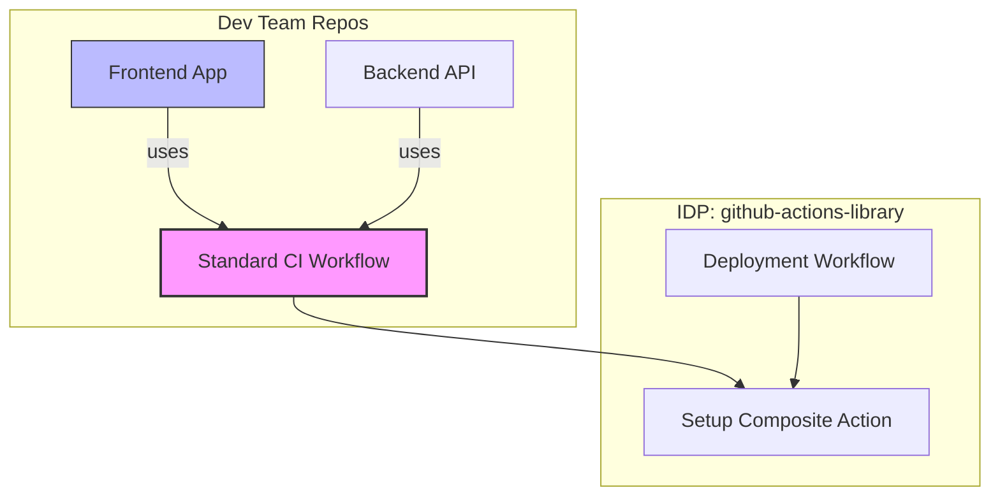

# GitHub Actions Library

```mermaid
graph TD
    subgraph "Dev Team Repos"
        AppA[Frontend App] -- "uses" --> CI
        AppB[Backend API] -- "uses" --> CI
    end

    subgraph "IDP: github-actions-library"
        CI[Standard CI Workflow]
        CD[Deployment Workflow]
        Comp[Setup Composite Action]
        
        CI --> Comp
        CD --> Comp
    end

    style CI fill:#f9f,stroke:#333,stroke-width:2px
    style AppA fill:#bbf,stroke:#333
```